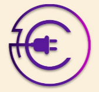
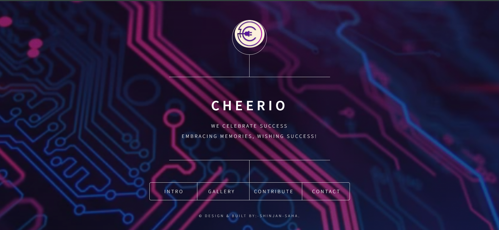
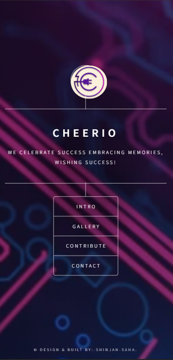

# Cheerio

Website For Farewell of ECE Department

 

## Tools & Language Used in the Website:-
<ul>
<li></li>
<li></li>  
<li></li>
<li></li>
<li></li>
</ul>

## Preview Of Website in Desktop

## Preview of Website in Mobile

## Visit The Website Here:-
[Visit Here!](https://cheerio-ece-farewell.vercel.app/)
